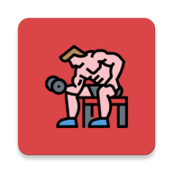

<h1 align="center">Welcome to DH-Fitness </h1>
<p>
</p>

<center>
    
</center>


> MODU's Health / 모두의 헬스 (SSAFY 3rd 자율프로젝트)

### 🏠 [Github](https://github.com/jesuisjavert/MODU) :clapper:[Demo 시연영상](https://www.youtube.com/watch?v=JnYyQUX-lPw&feature=youtu.be) :page_with_curl:[프로젝트 명세서](https://drive.google.com/file/d/1fWqLAJYHXRDeOOPT6kzg8ESiNVkAZr1h/view?usp=sharing) :microphone:[Presentation](https://drive.google.com/file/d/1LEiyBAhnahO3JV_hn3iLqF7BJafw2TFf/view?usp=sharing)

<br>

## ✨ Description

```sh
DH Fitness는 push-up 갯수를 카운팅, jogging step수 카운팅 및 운동 기록을 저장하는 어플입니다.
```


## :pushpin: Project Goal

```sh
 코로나 사태 이후, 우리의 삶은 ‘뉴 노말(New normal)’시대로의 전환을 맞이했습니다.
전염병의 확산을 막기 위한 ‘비대면/언택트(Untact)’의 시대에, 오프라인 대면 만남을 최소한으로 줄이려는 노력과,
그만큼 줄어든 활동량에 따라, 개인의 건강과 운동을 집에서 해결할 수 있는 ‘홈트레이닝’에 대한 수요가 급격하게
늘어나게 되었습니다. 
 그 결과, 2020년 업종별 폐업률 1위가 오프라인 피트니스 시장이 될 정도로, 피트니스 시장의 많은 자영업자들이
심각한 경제적 타격을 입은 것으로 보입니다. 이를 해결하기 위해, 온라인 홈트레이닝족과 오프라인 헬스트레이너를
연결하는 플랫폼 서비스를 만들어 국민건강증진과 트레이너 자영업자들의 경영난을 해소하기 위해 이 프로젝트를 기획했습니다.
 기존의 오프라인 피트니스 시장을 온라인 플랫폼에 안착시키고, 기존의 전문 기술력을 가진 헬스 트레이너들을 온라인 홈트레이닝 시장과 연결시켜
새로운 가치를 창출해내는 것은 유의미한 시도가 될 것입니다.
```


## :mag: 서비스 기능

<center>
    
</center>

## :mag: Overview

### 1. 유저 로그인 페이지 (User Login Page) (소셜로그인)

<center>
    
</center>
Kakao API를 이용 소셜 로그인 (OAuth)

<br>

### 2. 트레이너-고객 실시간채팅 Trainer - Client Chatting 

<center>
    
</center>
Node.js (Express Framework) 서버 Socket.io 통신으로 1:1 채팅 기능 구현

<br>

### 3. 트레이너-프로그램 추천 시스템 (Best Trainer/Program Carousel)

<center>
    
</center>
PT 프로그램 CRUD 기능 및 Carousel 화면 구성

<br>

### 4. 다중 화상통화 기능활용 온라인 홈트레이닝 세션 (Multiple User WebRTC(Realtime Camera) Online Personal Training)

<center>
    
</center>
webRTC API 활용 실시간 다자간 영상채팅 기능

<br>

### 5. 달력 기능과 연동한 스케쥴 관리(Schedule managment)

<center>
    
</center>
달력 페이지와 트레이너의 PT 프로그램 일정 및 시간 연동 CRUD & My Profile Page

<br>

### 6. 트레이너의 PT관리 CRUD(PT Program & Client management)

<center>
    
</center>
관리 중인 PT 프로그램과 회원 관리  My Page

<br>

### 7. PT프로그램 디테일 CRUD(PT Program CRUD)

<center>
    
</center>
PT Program 등록 CRUD (일정별 시간 관리)

<br>

### 8. 결제시스템 (카카오 페이 결제) Client Payment System

<center>
    
</center>
KakaoPay API 활용 PT 프로그램 결제 시스템, 결제 이후 캘린더로 일정 동기화

<br>

### 9. 실시간 알림 & 프로그램 리뷰 & 예약 시스템

### Realtime Notification & Review & Reservation System

<center>
    
</center>
트레이너와 회원간의 실시간 알림 기능 - Program별 리뷰 및 후기 댓글 기능

<br>


## :wrench: Tech Stack

### Tech Stack

<center>
    
</center>


### System Architecture

<center>
    
</center>

<br>

## :pencil2: ERD

<center>
    
</center>
<br>

## :runner: Steps to run

### Backend

```bash
$ cd modeling
$ python -m venv venv
$ source venv/Scripts/activate
$ python install -r requirements.txt
$ python manage.py runserver
```

### Frontend

```bash
$ cd frontend
$ npm install
$ npm run serve
```

<br>

## 🤼‍♂️Author

Team Leader : 🐯**Kang Donghoon**

Backend : 🐶 **Lee Changwan**

Backend: 🐺 **Bae Yongkyun**

Frontend : 🐱 **Kang Byungkook**

Frontend : 🦁 **Roh Hyunsuk**

<hr>

## :trophy: Awards

- SSAFY 자율 프로젝트 우수팀 선정 및 부상 100만원 수상


- SSAFY  Best Member 선정 & 50000 마일리지 수여

  


## 📝 License

Copyright © 2020  MODU's Health  <br>
